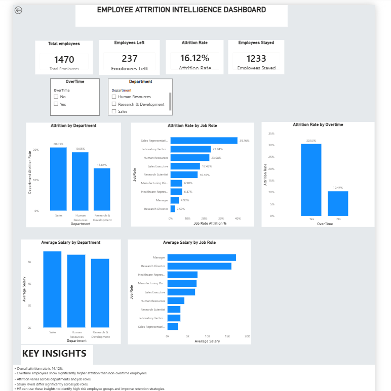

# Employee Attrition Intelligence

An end-to-end employee attrition analytics project that combines **Python, SQL, Power BI, and Machine Learning** to understand employee turnover and support data-driven retention decisions.

## 📌 Project Overview

Employee attrition is an important HR problem because high employee turnover can increase recruitment costs, reduce productivity, and affect organizational stability.

This project analyzes employee records to identify patterns associated with attrition and presents the findings through an interactive **Power BI dashboard**. A machine-learning model is also included to support employee attrition prediction.

## 🎯 Objectives

- Analyze overall employee attrition.
- Identify departments and job roles with higher attrition.
- Compare attrition between employees working overtime and those who do not.
- Analyze average salary across departments and job roles.
- Perform data cleaning and quality checks.
- Store and query employee data using SQL/MySQL.
- Build a machine-learning model for attrition prediction.
- Create an interactive Power BI dashboard.
- Produce a professional analysis report.

## 🛠️ Technologies Used

| Technology | Purpose |
|---|---|
| Python | Data analysis and machine learning |
| Pandas | Data manipulation and preprocessing |
| Matplotlib / Seaborn | Data visualization |
| Scikit-learn | Machine-learning model |
| Joblib | Saving the trained model and encoders |
| MySQL | Data storage and SQL analysis |
| Power BI | Interactive dashboard and visualization |
| Jupyter Notebook | Exploratory data analysis |
| Streamlit | Application interface |
| Git / GitHub | Version control and project sharing |

## 📂 Project Structure

```text
EMPLOYEE ATTRITION INTELLIGENCE/
│
├── data/
│   ├── raw/
│   │   └── WA_Fn-UseC_-HR-Employee-Attrition.csv
│   └── processed/
│
├── docs/
│
├── images/
│   └── dashboard.png
│
├── models/
│   ├── attrition_model.pkl
│   └── label_encoders.pkl
│
├── notebook/
│   └── employee_attrition_analysis.ipynb
│
├── outputs/
│   ├── department_analysis.csv
│   ├── jobrole_analysis.csv
│   └── overtime_analysis.csv
│
├── powerbi/
│
├── python/
│   ├── analysis.py
│   ├── data_quality.py
│   ├── load_data.py
│   └── test_mysql_connection.py
│
├── sql/
│   ├── queries.sql
│   ├── schema.sql
│   └── views.sql
│
├── src/
│
├── streamlit/
│   └── app.py
│
├── reports/
│   ├── employee_attrition_report.md
│   └── employee_attrition_report.pdf
│
├── .gitignore
├── requirements.txt
└── README.md
```

## 📊 Key Findings

The completed analysis contains **1,470 employees**.

- **237 employees** left the organization.
- **1,233 employees** stayed.
- Overall attrition rate: **16.12%**.
- Sales has an attrition rate of approximately **20.63%**.
- Human Resources has an attrition rate of approximately **19.05%**.
- Research & Development has an attrition rate of approximately **13.84%**.
- Employees working overtime show a higher observed attrition rate (**30.53%**) than employees not working overtime (**10.44%**).

These findings indicate that attrition is not evenly distributed and that employee retention strategies can be targeted toward higher-risk groups.

> Note: These are observed relationships in the dataset and should not be interpreted as proof that a particular factor directly causes attrition.

## 📈 Power BI Dashboard



The dashboard provides an interactive view of employee attrition across departments, job roles, overtime status, and salary levels.

The Power BI dashboard, **Employee Attrition Intelligence Dashboard**, contains:

- Total Employees KPI
- Employees Left KPI
- Attrition Rate KPI
- Employees Stayed KPI
- Department filter
- Overtime filter
- Attrition by Department
- Attrition Rate by Job Role
- Attrition Rate by Overtime
- Average Salary by Department
- Average Salary by Job Role
- Key business insights

## 🤖 Machine Learning

A machine-learning model is included to predict employee attrition based on employee-related features.

The trained model and label encoders are stored in:

```text
models/
├── attrition_model.pkl
└── label_encoders.pkl
```

The project uses a **Random Forest Classifier** for classification.

## 🗄️ SQL Analysis

The SQL section contains:

- Database schema
- Analytical queries
- SQL views
- MySQL connection testing

Files:

```text
sql/
├── schema.sql
├── queries.sql
└── views.sql
```

## 🚀 How to Run the Project

### 1. Clone the repository

```bash
git clone <your-github-repository-url>
cd "EMPLOYEE ATTRITION INTELLIGENCE"
```

### 2. Create and activate a virtual environment

```bash
python -m venv .venv
```

Windows:

```bash
.venv\Scripts\activate
```

### 3. Install dependencies

```bash
pip install -r requirements.txt
```

### 4. Run the Streamlit application

```bash
streamlit run streamlit/app.py
```

The application can then be opened in the browser using the local Streamlit URL shown in the terminal.

## 📓 Notebook

The Jupyter Notebook contains the main analytical workflow, including:

1. Data loading
2. Data inspection
3. Data quality checks
4. Exploratory analysis
5. Department-wise attrition analysis
6. Job-role analysis
7. Overtime analysis
8. Business insights

## 📄 Reports

The `reports/` directory contains the completed employee attrition analysis report in Markdown and PDF formats.

## 💡 Business Recommendations

Based on the observed patterns:

- Focus retention programs on departments with higher attrition.
- Investigate workload and overtime among employees with high turnover.
- Review job roles showing unusually high attrition.
- Use salary and role-level analysis to identify potential retention concerns.
- Combine dashboard monitoring with predictive analytics for proactive HR decision-making.

## ⚠️ Disclaimer

This project is intended for **educational, analytical, and portfolio purposes**. Predictions and observed relationships should be validated with additional organizational data before being used for real HR decisions.

## 👤 Author

**Anvesh Reddy Badugula**

B.Tech Student | Aspiring Data Analyst / Data Scientist

Skills demonstrated in this project include:

**Python • SQL • Power BI • Machine Learning • Data Analysis • Data Visualization • Streamlit**
